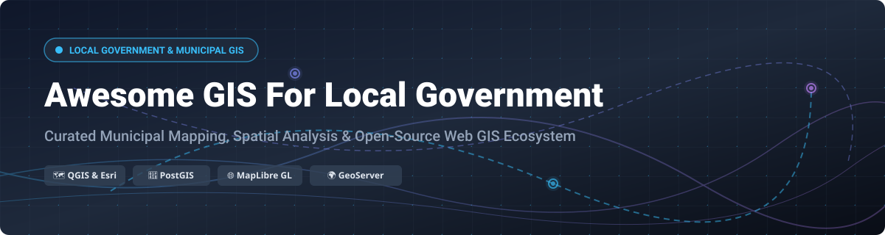

  

# 🗺️ Awesome GIS For Local Government 🏙️

> **Curated Ecosystem of Commercial SaaS Platforms & Open-Source Municipal Web Mapping Technologies**

---

### 📌 Overview & SEO Keywords
Welcome to the premier curated list of **Geospatial Information Systems (GIS) for Local Government**, **Municipal Web Mapping**, **City Planning & Spatial Analysis**, and **Public-Sector Infrastructure Management**. Whether you are a city GIS analyst, urban planner, municipal IT director, or geospatial software engineer, this directory tracks industry-standard SaaS platforms and production-ready open-source stacks powering smart cities, counties, and local public works worldwide.

**Last updated:** September 2026

---

## 📑 Table of Contents
- [☁️ SaaS & Commercial Platforms](#-saas--commercial-platforms)
- [🔓 Open-Source GitHub Projects](#-open-source-github-projects)
- [🏗️ Recommended Municipal Architecture Stacks](#%EF%B8%8F-recommended-municipal-architecture-stacks)
- [🤝 How to Contribute](#-how-to-contribute)
- [💖 Support & Sponsorship](#-support--sponsorship)
- [📈 Star History](#-star-history)
- [⚠️ Disclaimer](#%EF%B8%8F-disclaimer)

---

## ☁️ SaaS & Commercial Platforms

> 💡 **Market Size & Structure Note**: The global **Geospatial & GIS Market size is estimated at ~$14.5 Billion** (with local government representing ~25–30% of total public sector spatial spend). The market is **moderately concentrated at the top** dominated by Esri (the enterprise municipal standard) and Bentley Systems, while displaying **high fragmentation in specialized niches** such as cloud vector analytics (Carto), developer web map APIs (Mapbox), high-resolution aerial imagery (Nearmap), and collaborative civic mapping (Felt).

| SaaS Product | Size (Revenue / Valuation) 📊 | Starting Tier Pricing 💵 | Free Tier / Trial Limits ⏳ | Key Capabilities & Municipal Use Cases 🏙️ |
| :--- | :--- | :--- | :--- | :--- |
| **[Bentley OpenCities Planner](https://www.bentley.com/)** | **~$1.6B Revenue** / **~$9.5B Market Cap** | **~$1,500/year** (Standard Practitioner license) | **14-Day Free Trial** (Full 3D digital twin feature access) | 3D city planning, digital twin visualization, and public consultation for municipal infrastructure. |
| **[ArcGIS Online / Enterprise (Esri)](https://www.esri.com/)** | **~$1.3B Revenue** / **Privately Held** | **~$700/user/year** (Creator User Type) | **21-Day Free Trial** (Includes 5 Creator licenses + 400 service credits); **Personal Use Plan** at $100/yr (Non-commercial) | The undisputed industry standard for municipal spatial data management, parcel mapping, 311 dashboards, and field operations. |
| **[Precisely Spectrum / Location Intelligence](https://www.precisely.com/)** | **~$700M Revenue** / **~$3.5B Valuation** | **~$5,000/year** (Enterprise Base Tier) | **30-Day Free Trial** (Access to address autocompletion & geocoding APIs) | High-accuracy geocoding, parcel data integrity, and address validation for tax assessment and emergency services (911). |
| **[Nearmap](https://www.nearmap.com/)** | **~$100M+ Revenue** (Acquired by Thoma Bravo) | **~$1,200/year** (Basic Local Government Seat) | **7-Day Demo/Trial** (Custom organizational access upon request) | High-resolution, frequently updated aerial imagery and AI-derived roof/property attributes for code enforcement & planning. |
| **[Mapbox](https://www.mapbox.com/)** | **~$93M Revenue** / **~$1.3B Valuation** | **Pay-As-You-Go** ($0.005 per web map load after free tier) | **50,000 Free Map Loads/month** (or 25,000 Mobile Active Users/month) | High-performance custom vector basemaps, web applications, and interactive public transport portals. |
| **[Carto](https://carto.com/)** | **~$29M Revenue** / **~$50M+ VC Funding** | **Pay-As-You-Go** ($199/month starting tier) | **14-Day Free Trial** (Full platform access); **5 Million Tile Requests/month** free for CARTO Basemaps | Cloud-native spatial analytics, spatial SQL on data warehouses (Snowflake, BigQuery), and location intelligence. |
| **[Cityworks (Trimble)](https://www.cityworks.com/)** | **Trimble GIS (~$3.8B Parent Rev)** | **~$3,000/year** (Base Municipal Module) | **Demo / Guided Trial** (Available via Trimble local government reps) | GIS-centric asset management, work order management, and permitting for municipal public works & utilities. |
| **[Maptitude](https://www.caliper.com/maptitude/)** | **Private / Multi-Million Revenue** | **$795/year** (Desktop Subscription) | **14-Day Money-Back Guarantee / Evaluation Demo** | Demographic spatial analysis, redistricting, municipal service area modeling, and parcel management. |
| **[Felt](https://felt.com/)** | **Private** (~$15M VC Raised) | **$30/user/month** (Professional Plan) | **Free Personal Plan** (Unlimited maps & public sharing; strictly non-commercial, no shapefile/raster uploads) | Modern collaborative web mapping, real-time feedback, and public engagement for city council presentations. |
| **[QGIS Cloud](https://qgiscloud.com/)** | **Private / Community Supported** | **€65/month** (~$70/mo for QGIS Cloud Pro) | **QGIS Cloud Free** (Unlimited public non-commercial maps; 1 PostGIS DB up to 50 MB) | One-click web map publishing directly from QGIS desktop projects for small municipal teams. |

---

## 🔓 Open-Source GitHub Projects

> 🌟 *Open-source software powers the core infrastructure of modern municipal GIS worldwide. Star count badges link directly to each repository's stargazers page.*

| Open-Source Project 🛠️ | Popularity & Stargazers ⭐️ | Core Description & Local Government Applications 🚀 |
| :--- | :--- | :--- |
| **[Leaflet](https://github.com/Leaflet/Leaflet)** |  | Ultra-lightweight JavaScript library for mobile-friendly interactive web maps. Popular for lightweight public city portals. |
| **[QGIS](https://github.com/qgis/QGIS)** |  | The premier open-source desktop GIS. Full-featured vector/raster analysis, parcel editing, cartography, and Python scripting. |
| **[OpenLayers](https://github.com/openlayers/openlayers)** |  | Comprehensive, feature-rich web mapping engine for complex municipal web GIS, heavy layer rendering, and OGC standards. |
| **[MapLibre GL JS](https://github.com/maplibre/maplibre-gl-js)** |  | Community-governed open-source vector tile rendering library for fast, GPU-accelerated custom web and mobile web maps. |
| **[Turf.js](https://github.com/turfjs/turf)** |  | Advanced spatial analysis in JavaScript. Enables client-side geofencing, buffering, and polygon intersections in browser apps. |
| **[GDAL / OGR](https://github.com/OSGeo/gdal)** |  | The foundational C++/Python library for translating, converting, and processing virtually every spatial raster and vector format. |
| **[GeoServer](https://github.com/geoserver/geoserver)** |  | Standard Java web server for publishing geospatial data via OGC web services (WMS, WFS, WMTS, Vector Tiles). |
| **[Mapnik](https://github.com/mapnik/mapnik)** |  | C++ toolkit for beautiful cartographic map rendering, widely used for generating custom basemap tiles. |
| **[PostGIS](https://github.com/postgis/postgis)** |  | Spatial database extension for PostgreSQL. The standard open-source enterprise spatial database for parcel and infrastructure data. |
| **[GeoNode](https://github.com/GeoNode/geonode)** |  | Open-source Geospatial Content Management System (GeoCMS) for managing data catalogs, metadata, and web permissions. |
| **[Tippecanoe (Felt)](https://github.com/felt/tippecanoe)** |  | CLI tool to build vector tile pyramids from large municipal datasets (parcels, contours, roads) at any zoom level. |
| **[TerriaJS](https://github.com/TerriaJS/terriajs)** |  | Open-source framework for building 3D/2D web-based spatial data catalog explorers (powered by Cesium and Leaflet). |
| **[MapServer](https://github.com/MapServer/MapServer)** |  | High-performance C-based engine for rendering spatial data into web services and interactive maps. |
| **[GRASS GIS](https://github.com/OSGeo/grass)** |  | Advanced open-source GIS engine for raster processing, hydrologic modeling, terrain surface analysis, and satellite image processing. |

---

## 🏗️ Recommended Municipal Architecture Stacks

Local governments typically implement one of three deployment patterns:

1. **🏢 Commercial Enterprise Stack (Esri Centric)**:
   - *Database*: ArcGIS Enterprise / Enterprise Geodatabase (SQL Server or Oracle)
   - *Desktop*: ArcGIS Pro
   - *Server/Cloud*: ArcGIS Online + Field Maps + Experience Builder
   - *Asset Integration*: Cityworks / Cartegraph

2. **⚡ Fully Open-Source Municipal Stack**:
   - *Database*: PostGIS (PostgreSQL)
   - *Desktop*: QGIS (with custom Python plugins & QField for mobile)
   - *Server*: GeoServer or QGIS Server
   - *Web Client*: MapLibre GL JS or Leaflet
   - *Tiling*: Tippecanoe vector tiles

3. **🔄 Hybrid Modern Web Stack**:
   - *Database*: PostGIS + Snowflake/BigQuery
   - *Analytics & ETL*: QGIS + GDAL/OGR scripts
   - *Web Viz & Apps*: Carto / Mapbox / Felt + Leaflet public portals

---

## 🤝 How to Contribute

Contributions are warmly welcomed! Help keep this directory accurate and comprehensive.

1. 🍴 **Fork** this repository.
2. 📝 **Add or update** entries in `README.md` following the tabular formats above.
3. 🔗 Include official URLs, factual descriptions, pricing tiers, and open-source star badges.
4. 📬 Submit a **Pull Request** with a concise description of your changes.

---

## 💖 Support & Sponsorship

If you find this repository valuable for your municipal GIS research, city planning projects, or open-source web map development:

- ⭐ **Star this repository** on GitHub to help others discover it!
- 🔀 **Fork it** to customize your own local government tech evaluation.
- 📢 **Share it** with fellow GIS analysts, urban planners, and civic technology teams.
- ☕ **Buy me a coffee**: Support ongoing open-source curation and tool development via the [GitHub Sponsor Dashboard](https://github.com/sponsors/ishandutta2007).

---

## 📈 Star History

---

## ⚠️ Disclaimer

- This repository is a **community-curated overview** intended for educational and market research purposes. It does not constitute an official endorsement of any vendor or platform.
- Municipal spatial data often includes sensitive infrastructure, emergency routing, tax assessments, and parcel records. Always adhere to local government data governance, cybersecurity standards, and legal privacy regulations when deploying GIS.

---

  <b>Built with ❤️ for municipal GIS analysts, city planners, public works directors, and civic hackers.</b>

